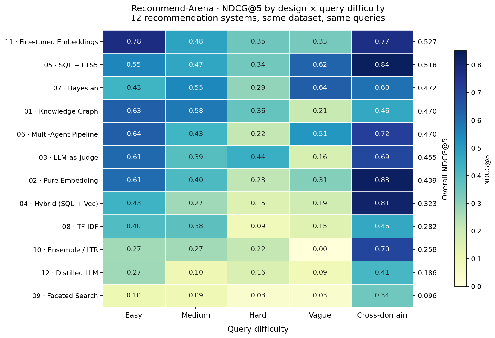

# recommend-arena

Twelve recommendation-system designs, one shared interface, one shared dataset, one benchmark. Same queries go in; we measure which approach actually retrieves the right products and why.

The premise: instead of picking a recommender architecture upfront, build the major contenders, hold them to the same evaluation, and let NDCG decide.



## What's in here

```
designs/                # 12 design documents (the "spec" for each implementation)
implementations/        # 12 working Python packages — one per design
shared/                 # Recommender protocol + LLM provider abstraction
benchmark/              # Test data, runner, metrics, ground-truth queries
benchmark/results/      # Committed evidence — NDCG/MRR/latency per design
docs/thumbnail.png      # The heatmap above (regenerable via scripts/build_heatmap.py)
```

Every implementation conforms to a single protocol so the runner can swap them in interchangeably:

```python
class Recommender(Protocol):
    def ingest(self, products: list[dict], reviews: list[dict], domain: str) -> None: ...
    def query(self, query_text: str, domain: str, top_k: int = 10) -> list[RecommendationResult]: ...
```

## The twelve designs

| # | Design | Approach |
|---|---|---|
| 01 | Knowledge Graph | NetworkX graph over products, attributes, terrain tags; query rewrites to graph traversal |
| 02 | Pure Embedding | ChromaDB + BGE embeddings over product+review text |
| 03 | LLM-as-Judge | RAG retrieval, then pointwise LLM scoring |
| 04 | Hybrid (SQL + Vector) | Dual-track SQLite filtering and vector recall, fused at the end |
| 05 | SQL + FTS5 | SQLite FTS5 with BM25 — pure lexical baseline |
| 06 | Multi-Agent Pipeline | Function pipeline (parse → retrieve → re-rank → explain) |
| 07 | Bayesian | Conjugate priors / Dirichlet-Multinomial over attribute evidence |
| 08 | TF-IDF | Sparse feature vectors with learned attribute weights |
| 09 | Faceted Search | SQLite-backed facet matcher, no semantic layer |
| 10 | Ensemble / LTR | XGBoost ranker over BM25 + FAISS + structured features |
| 11 | Fine-tuned Embeddings | Contrastive fine-tune of a small embedding model on synthetic query/product pairs |
| 12 | Distilled LLM | Small student model distilled from an LLM teacher |

## The dataset

Two product domains let us check that nothing has overfit to skis:

- **Skis** — 25 products differentiated across race / carving / all-mountain / freeride / powder / freestyle / beginner; 132 reviews written to cover the attribute space (with deliberate overlap of phrasing between reviews and queries to stress semantic matching).
- **Running shoes** — 10 products, 50 reviews. Used by the cross-domain queries to verify each design can switch domains without code changes.

Twenty test queries spread across five difficulty buckets:

| Bucket | Count | What it tests |
|---|---|---|
| Easy | 5 | Single clear attribute (`"powder ski with good float"`) |
| Medium | 5 | Multiple constraints (`"titanal construction ski with edge grip for hardpack and at least 95mm waist"`) |
| Hard | 5 | Negations, ranges, trade-offs (`"freeride ski that is NOT playful, stiff with high stability, over 105mm waist"`) |
| Vague | 3 | Subjective / metaphorical (`"a ski that feels alive underfoot"`, `"good ski for the ice coast"`) |
| Cross-domain | 2 | Domain switch into running shoes |

Each query carries a hand-curated `ground_truth_top5` with relevance grades (1–3), enabling standard NDCG.

## Metrics

- **NDCG@5 / @10** — primary ranking quality (relevance-weighted, position-discounted)
- **MRR** — how soon the first highly-relevant result appears
- **Attribute F1** — precision/recall of the attributes each design claims it matched on
- **Coverage** — fraction of queries that returned at least one relevant result
- **Explanation Quality** — automated proxy: does the explanation reference real product attributes, not hallucinations
- **Latency** — ingestion ms, query p50/p95/p99 (median of 3 runs)

Full definitions and formulas are in [`benchmark/README.md`](benchmark/README.md).

## Current results

NDCG@5 overall, sorted (also visible in the heatmap above):

| Rank | Design | NDCG@5 | Notes |
|---|---|---|---|
| 1 | 11 · Fine-tuned Embeddings | 0.527 | Best on easy + cross-domain |
| 2 | 05 · SQL + FTS5 | 0.518 | Surprisingly strong; best on vague queries |
| 3 | 07 · Bayesian | 0.472 | Best on vague queries (tied with #5) |
| 4 | 01 · Knowledge Graph | 0.470 | Best on medium, weak on vague |
| 5 | 06 · Multi-Agent | 0.470 | |
| 6 | 03 · LLM-as-Judge | 0.455 | Slow but explanation-rich |
| 7 | 02 · Pure Embedding | 0.439 | |
| 8 | 04 · Hybrid (SQL+Vec) | 0.323 | Fusion underperforms either track alone |
| 9 | 08 · TF-IDF | 0.282 | |
| 10 | 10 · Ensemble / LTR | 0.258 | LTR overfits the small training signal |
| 11 | 12 · Distilled LLM | 0.186 | Slow + lossy distillation |
| 12 | 09 · Faceted Search | 0.096 | No semantic layer = brittle on natural-language queries |

The headline finding: a fine-tuned mini-embedding model beats every off-the-shelf vector approach **and** beats a 175B-class teacher distilled into a small student. The lexical SQL+FTS5 baseline is the dark horse — it's the cheapest design here and it lands second.

## Running it

Python 3.9+. Some designs require a local Ollama for embeddings or LLM calls.

```bash
# Full benchmark across every design
python benchmark/runner.py --recommenders implementations/

# A subset
python benchmark/runner.py --recommenders implementations/ --filter "design_05_sql,design_11_finetuned_embed"

# Stable latency numbers
python benchmark/runner.py --recommenders implementations/ --runs 5
```

Results land in `benchmark/results/`:
- `summary.txt` / `summary.json` — comparison tables
- `per_query/{design}_{query_id}.json` — what each design returned for each query, alongside the ground truth

## Regenerating the thumbnail

```bash
python scripts/build_heatmap.py
```

Reads from `benchmark/results/` and rewrites `docs/thumbnail.png`.

## Status

Active. Designs 1–10 have benchmark data committed; designs 11 and 12 are the most recent additions and represent the trained-model branch of the project (model artifacts themselves are gitignored; retrain with the trainer in each implementation package).
